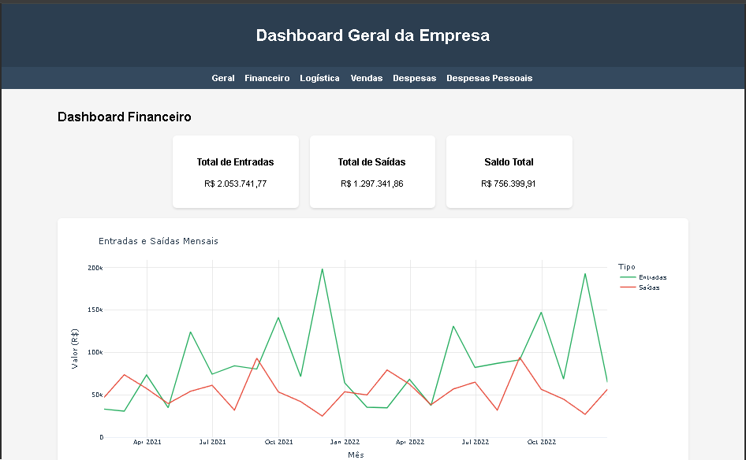

# 📊 Dashboard Empresarial - Projeto Power BI

## 🌟 Visão Geral
Este projeto implementa um **Dashboard Geral da Empresa** utilizando Python, Dash e Plotly, com integração via Docker 🐳. O objetivo é fornecer uma visão consolidada e interativa das áreas financeira, logística e de vendas, conectando três dashboards especializados que atendem aos casos de uso descritos em `case_aula1.txt`, `case_aula2.txt` e `case_aula3.txt`. Um dashboard adicional para despesas da empresa e outro para despesas pessoais do gestor foram incluídos para análises específicas. Os dados são carregados de arquivos CSV, processados e visualizados em gráficos interativos para suportar a tomada de decisão estratégica 🚀.

## 📁 Estrutura do Projeto
- **app.py** 🐍: Aplicação principal em Python usando Dash para criar os dashboards.
- **requirements.txt** 📋: Lista de dependências (pandas, dash, plotly, gunicorn).
- **Dockerfile** 🛠️: Configuração para construir a imagem Docker da aplicação.
- **docker-compose.yml** ⚙️: Configuração para executar o contêiner com Gunicorn.
- **csv/** 📊:
  - `relatorio.csv`: Dados financeiros para o Dashboard Financeiro.
  - `setores.csv`: Dados de setores para análise de despesas.
  - `historico_importacao.csv`: Dados de importações para o Dashboard de Logística.
  - `pedidos.csv`: Dados de pedidos para o Dashboard de Vendas.
  - `Bandeiras Países.csv`, `cadastro de exeções.csv`, `Produtos.csv`: Arquivos adicionais para suporte.
  - `despesas.csv`: Dados de despesas pessoais do gestor e despesas da empresa.
- **docs/** 📝: Documentação dos casos de uso (business cases) para cada dashboard.

## 📈 Dashboards
### 1. Dashboard Geral 🌐
- **Objetivo**: Fornece uma visão consolidada dos KPIs principais das três áreas.
- **Métricas**:
  - 💰 Saldo Financeiro (R$)
  - 🚚 Total de Embarques
  - 🛒 Total de Vendas (R$)
- **Visualizações**:
  - 📊 Gráfico de barras com resumo dos KPIs.
  - 🔗 Links de navegação para os dashboards específicos.

### 2. Dashboard Financeiro (Aula 1) 💸
- **Contexto**: Otimizar a gestão do fluxo de caixa e planejar estratégias financeiras.
- **Dados**: `relatorio.csv`, `setores.csv`
- **Métricas**:
  - 📈 Total de Entradas (R$)
  - 📉 Total de Saídas (R$)
  - ⚖️ Saldo Total (R$)
- **Visualizações**:
  - 📉 Linha: Entradas e Saídas Mensais
  - 📈 Linha: Saldo Acumulado ao Longo do Tempo
  - 📊 Barras: Entradas e Saídas por Categoria
  - 🍩 Rosca: Despesas por Setor

### 3. Dashboard de Logística (Aula 2) 🚛
- **Contexto**: Melhorar o monitoramento de embarques de importação para uma torre de controle eficiente.
- **Dados**: `historico_importacao.csv`
- **Métricas**:
  - 🚚 Total de Embarques
  - ⚖️ Peso Total (kg) (proxy para custo, ajustar se necessário)
- **Visualizações**:
  - 🍕 Pizza: Distribuição por Tipo de Serviço
  - 📊 Barras: On Time Delivery (OTD) por Modal (Aéreo, Marítimo)

### 4. Dashboard de Vendas (Aula 3) 🛍️
- **Contexto**: Analisar receitas, volumes e sazonalidade para a empresa AgroFruits.
- **Dados**: `pedidos.csv`
- **Métricas**:
  - 💵 Total de Vendas (R$)
  - 📦 Total de Produtos Vendidos
- **Visualizações**:
  - 📊 Barras: Vendas Totais por Produto
  - 📈 Linha: Volume de Produção por Mês (Sazonalidade)

### 5. Dashboard de Despesas 💼
- **Contexto**: Analisar despesas da empresa para controle financeiro.
- **Dados**: `despesas.csv`, `setores.csv`
- **Métricas**:
  - 💰 Total de Despesas (R$)
  - 📊 Média por Despesa (R$)
  - 📈 Número de Transações
- **Visualizações**:
  - 📈 Linha: Despesas Mensais
  - 📊 Barras: Despesas por Categoria
  - 🍩 Rosca: Despesas por Setor

### 6. Dashboard de Despesas Pessoais 💳
- **Contexto**: Análise independente das despesas pessoais do gestor, separada das finanças da empresa, para otimização do orçamento pessoal.
- **Dados**: `despesas.csv`
- **Métricas**:
  - 💰 Total de Despesas (R$)
  - 📊 Média por Despesa (R$)
  - 📈 Número de Transações
- **Visualizações**:
  - 📊 Barras Horizontais: Gasto Total por Categoria (Top 5)
  - 📊 Barras Verticais: Frequência de Transações por Categoria (Top 5)
  - 📈 Linha: Gasto Mensal ao Longo do Tempo
  - 🍩 Rosca: Distribuição de Gastos (Top 6 + Outros)
  - 📍 Dispersão: Picos de Gasto Diário
- **Insights**: Resumo textual com categorias dominantes, tendências, picos e anomalias, além de recomendações para controle financeiro.

## 🛠️ Requisitos
- **Python 3.9+** 🐍
- **Dependências** (listadas em `requirements.txt`):
  - 📊 pandas
  - 🌐 dash
  - 📈 plotly
  - ⚙️ gunicorn
- **Docker** e **Docker Compose** 🐳 para implantação.

## 🚀 Como Executar
1. **Localmente**:
   - Instale as dependências: `pip install -r requirements.txt` 📋
   - Execute a aplicação: `python app.py` 🐍
   - Acesse em: `http://0.0.0.0:8050` 🌐
2. **Com Docker**:
   - Certifique-se de que os arquivos CSV estão no diretório `csv/` 📁
   - Construa e execute: `docker-compose up --build` 🛠️
   - Acesse em: `http://vmlinuxd:8050` 🌐
   - Para desenvolvimento, edite `app.py` e reinicie o contêiner: `docker compose restart dashboard` 🔄

## ✨ Melhorias Realizadas
- **Carregamento de Dados** 📥: Substituição de dados embutidos por leitura de arquivos CSV (`relatorio.csv`, `setores.csv`, `historico_importacao.csv`, `pedidos.csv`, `despesas.csv`).
- **Dashboard Geral** 🌐: Adicionado gráfico de barras para resumir KPIs das três áreas.
- **Financeiro** 💸: Mantidas visualizações alinhadas ao caso de uso (fluxo de caixa, despesas por categoria e setor).
- **Logística** 🚛: Adicionado gráfico de OTD por modal para avaliar desempenho de entrega.
- **Vendas** 🛍️: Incluído gráfico de sazonalidade para análise de volume mensal.
- **Despesas Pessoais** 💳: Novo dashboard independente para o gestor, com análises detalhadas de gastos pessoais, tendências e recomendações.
- **Robustez** 🛡️: Adicionado tratamento de erros para carregamento de arquivos e dados vazios.
- **Estilo** 🎨: Design consistente com fundo claro, sombras e layout em grade.

## 📝 Notas
- ⚠️ Ajuste o campo de custo no Dashboard de Logística se disponível (atualmente usa `Peso (kg)` como proxy).
- ℹ️ O arquivo `Cadastro de Operadores Logísticos.csv` está vazio, limitando a análise de desempenho de operadores.
- 📁 Os arquivos CSV devem estar no diretório `csv/` para correto funcionamento.

## 👨‍💻 Autor
Desenvolvimento inspirado no curso de Power BI, adaptado para Dash e Plotly.
**Data**: 30 de Maio de 2025 🗓️